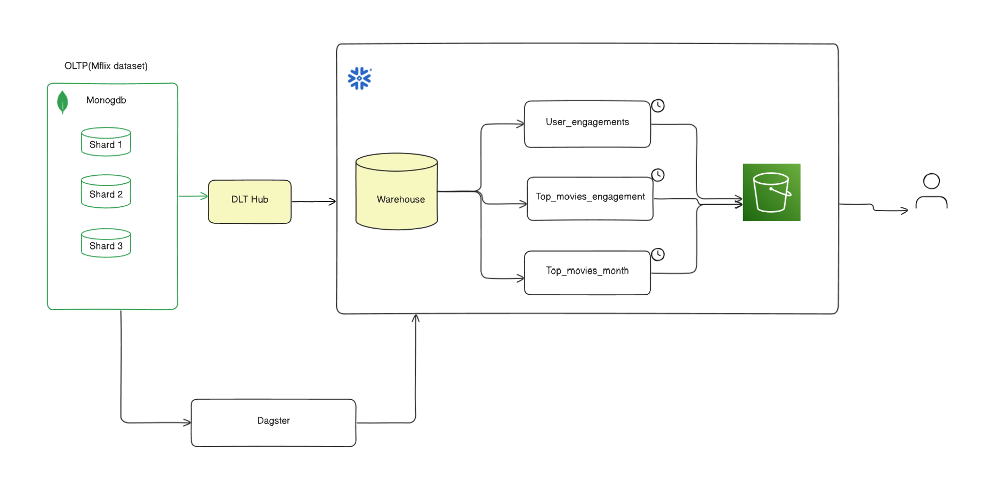
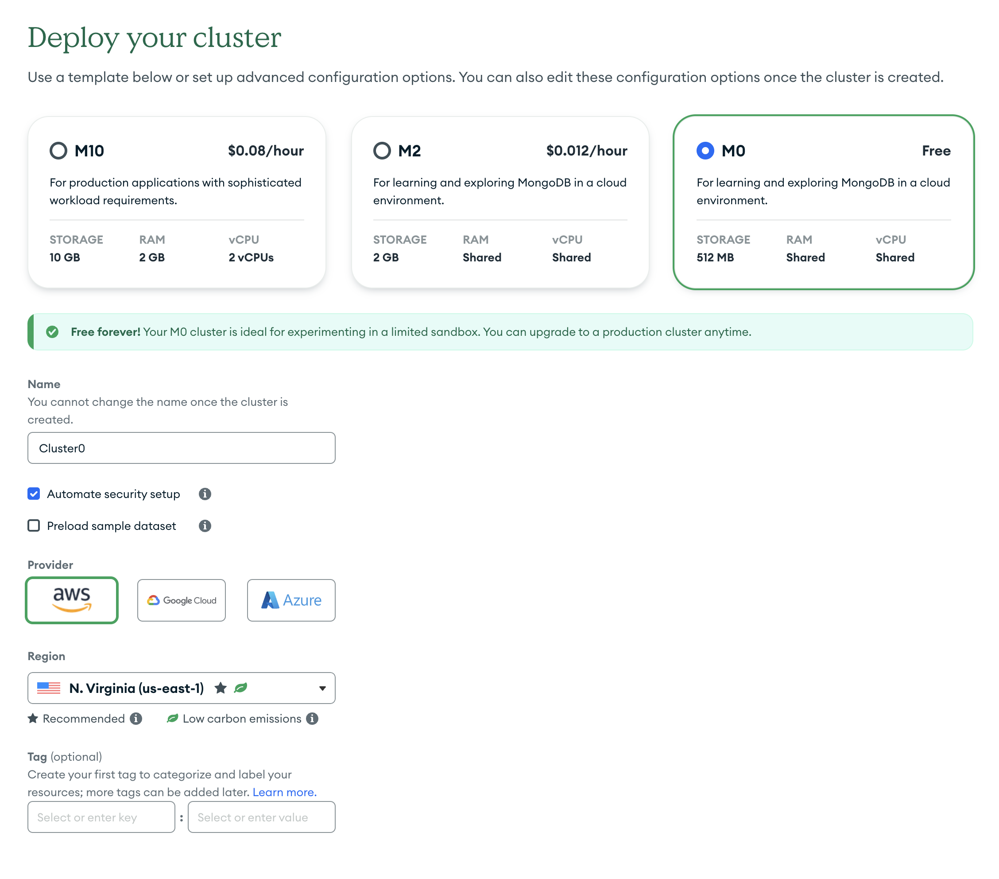

# Dagster Mflix Demo

This is a ETL pipeline built using Dagster and the Mflix dataset. The goal of this project is to demonstrate how to use Dagster to build a data pipeline that ingests data from MongoDB and loads it into Snowflake.


## Features

- Asset based, declarative orchestration
- Embedded ELT using data load tool
- How to backfill DAGs using Partitions
- How to setup Schedules and Jobs
- Experimental features: Sensors and Auto Materialization policies


## System Architecture

At a high level, the system architecture is a pipeline that ingests  OLTP data from MongoDB and loads it into Snowflake warehouse(OLAP) for analytics. This flow is oarchestrated using Dagster.




## Configuration and Local Setup

### Mongodb setup with sample data
Sign up for MongoDB Atlas and select the sample mflix dataset: https://www.mongodb.com/docs/atlas/sample-data/#std-label-load-sample-data


### Snowflake Signup and setup
Sign up for Snowflake and create a warehouse, database and role. You can use the free trial credits to get started. Follow the instructions here: https://docs.snowflake.com/en/user-guide/admin-setup.html
-  Run the following commands in the Snowflake UI to create the warehouse, database and role. You can also use the Snowflake CLI to run these commands.
```sql
use role accountadmin;

create warehouse if not exists dagster_wh with warehouse_size='x-small';
create database if not exists dagster_db;
create role if not exists dagster_role;

grant usage on warehouse dagster_wh to role dagster_role;
grant role dagster_role to user username;
grant all on database dagster_db to role dagster_role;
```

## Setting up Project
- clone the repo
- cd into the repo
- create a virtual environment and install the requirements
        
```bash
    python3 -m venv .venv
    source .venv/bin/activate
    pip install -e".[dev]"
```

- cp `.env.example` to `.env` and update the following variables
and setup the credentials for your MongoDB and Snowflake instances.

- Now you can run the dagster UI using the following command:

```bash
    dagster dev
```

- navigate to `localhost:3000` to see the Dagster UI. You should see the following screen:


That's it ! You are now ready to run the Dagster pipeline. happy data engineering!

